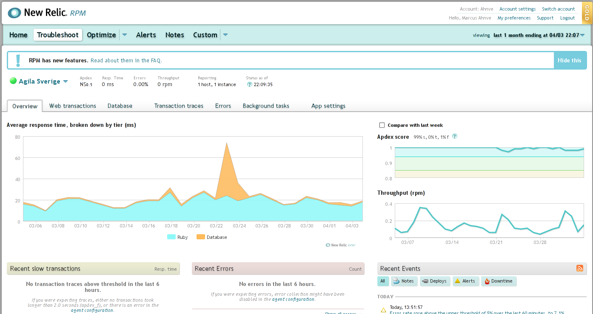
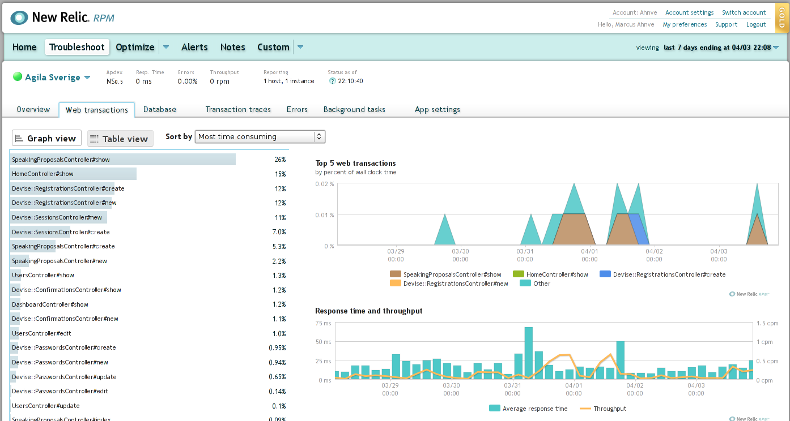
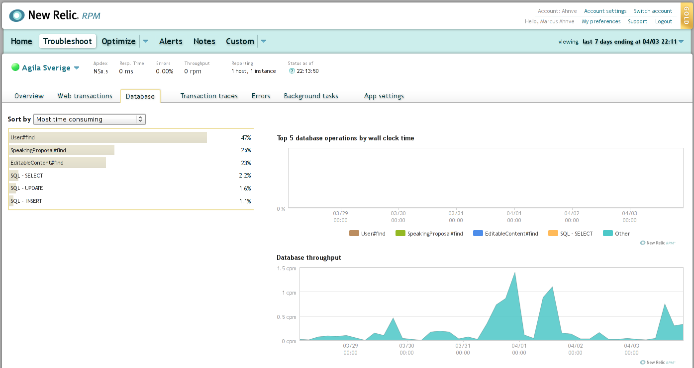

!SLIDE bullets

# Editors

* Vim
* Emacs
* IntelliJ / RedMine
* Eclipse
* TextMate

# Continuous Integration

* CIJoe
* CruiseControl.rb
* Cerberus

!SLIDE 

# New Relic RPM

!SLIDE full-page

!SLIDE full-page

!SLIDE full-page

!SLIDE code

    @@@ Ruby

    gem 'newrelic_rpm'

!SLIDE commandline

    $ cp new_relic.yml config

!SLIDE bullets

# Not only Rails

* PHP
* .Net
* Java

!SLIDE smbullets

# Exceptional

* Exceptions
* 404's
* Emails
  * Exceptions
  * Comments
  * Digest
* Reports
  * Campfire
  * Lighthouse
  * General Post
